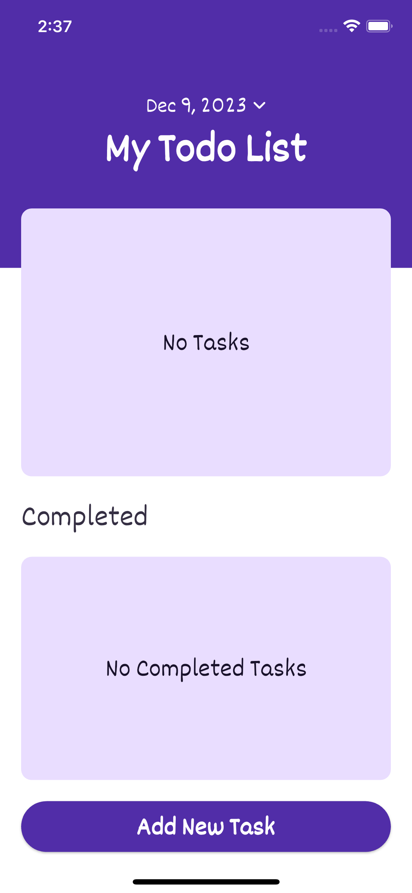
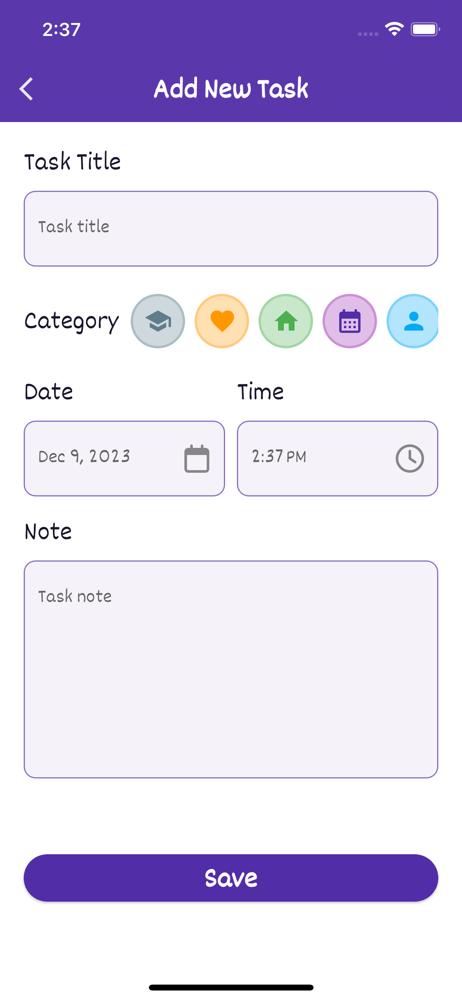
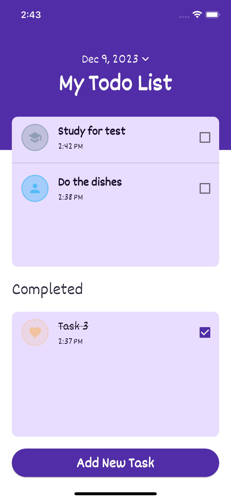
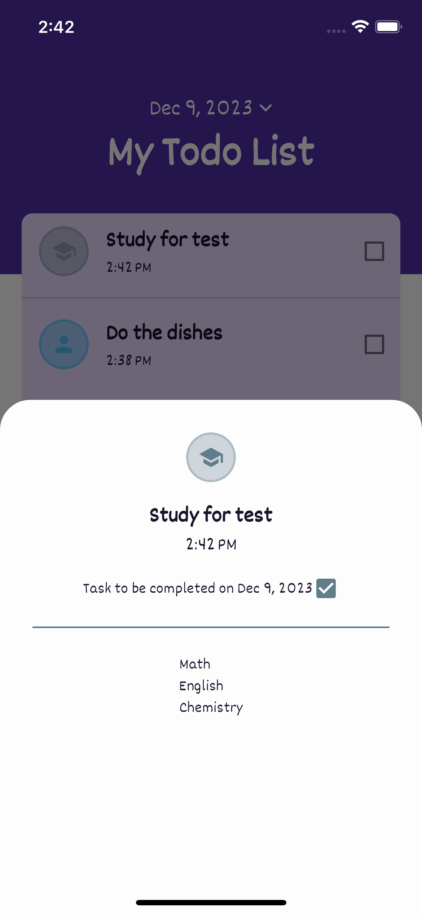

# Project: ToDo List

## Desccription
This is a ToDo List mobile applicaiton built with Flutter. RIverpod was used for state management and sqflite was used for saving application data locally.

## Features
- Users can perform CRUD operations on/with tasks.
- Tasks can be marked as completed or not, and can also be filtered by date.
- Tasks are seperated into categories for better usability.

   

  

